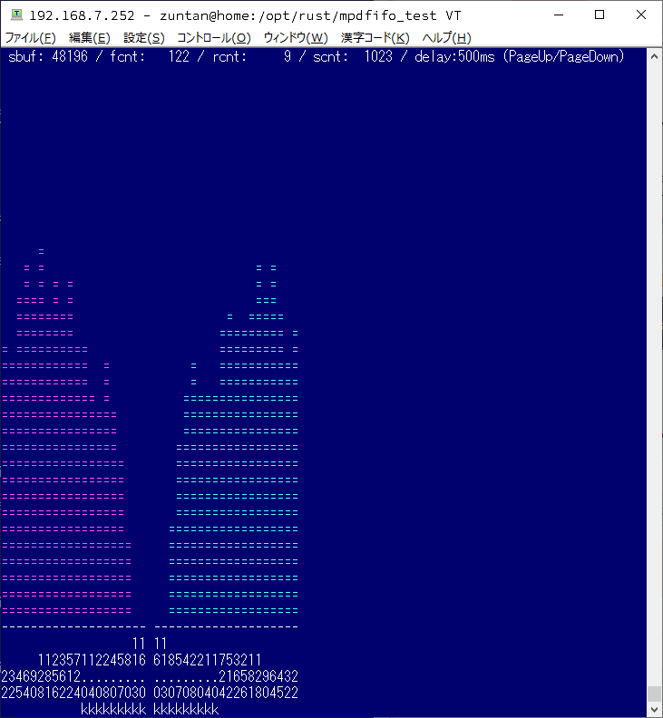

# mpdfifo_test

# screen shot



# 概要

 - mpd の設定で、fifo にPCMデータを出力できるようなので、このデータを拾って FFT にかけて、スペクトルアナライザみたいなものを作ってみました。

 - mpd側では、事前に以下の設定を行っておきます。
```
audio_output {
    type                    "fifo"
    name                    "my_fifo"
    path                    "/tmp/mpd.fifo"
    format                  "44100:16:2"
}
```


 - プログラムとしては４つのスレッドを起動させ、それぞれ以下の処理をします。


 - メインスレッド
    - サブスレッドの起動と、画面描画を行います。
    - 画面描画には、[termion](https://crates.io/crates/termion) を使いました。
    - 画面描画のタイミングは、タイマー用スレッドからもらっています。
    - 描画データは以下の『fifoデータの取得とFFTを実行するスレッド』で作成されますが、そちらとは非同期で画面が更新されます。65msec毎 (16fps) としてます。（が正しいかどうか...）。


 - タイマー用スレッド
    - 単純に一定時間 sleep したのち、メインスレッドにメッセージを送っています。


 - キー入力用スレッド
    - キーボードの入力を監視して、メインスレッドにメッセージを送っています。
    - スペクトルアナライザの表示に対してディレイをかけているのですが、この設定を PageUp, PageDown で変更する処理を行っています。


 - fifoデータの取得とFFTを実行するスレッド
    - fifo を O_NONBLOCK でリードして、バッファに詰めます。
    - バッファが FFT用のサイズ (4096) + ディレイ分 溜まったら、FFT処理します。
    - FFT の結果をパワーに変換し、ちょっと補正します。（ピンクノイズがだいたいツライチになるよーに、高域に向かって上げる感じの補正です。）
    - FFT の結果は、一定周波数の間隔なので、聴感的にはオクターブ（logスケール）が良いかなと思い、一定オクターブ間隔で平均し、その周波数帯のパワーとしています。
    - 左右チャンネルで 22, 32, 45, 64, 90, 128, 181, 256, 362, 512, 724, 1k, 1.4k, 2k, 2.8k, 4.0k, 5.7k, 8k, 11.3k, 16.0k で 1/2オクターブ間隔の 20 バンドとなります。
    - FFT解析には、[chfft](https://crates.io/crates/chfft) と [rustfft](https://crates.io/crates/rustfft) を試しました。chfft の方か CPU 使用率がちょっとだけ少なかったので、chfftを採用しました。[日本の方](https://qiita.com/chalharu/items/9a6b23170349ae013f40)がつくったよーです。感謝。


 - **CUIで動いている割には、結構良く動きます。かなりそれっぽいです。**


 - 問題点
    - やり方がまずいのかわかりませんが...
    - mpd 側で wav ファイルを再生するときは、fifo の出力と音が出るタイミングにズレはないのですが、**mp3 ファイルを再生させると、fifoの出力に対し、音が出るタイミングが、500msec 程遅延します**。
    - mpd のデーコード処理の問題かと思いましたが、**fifoには先にPCMデータが出ているということは、既にデコードは終わっているので、それの後に 500msec も遅れる理由は無い** よーな気がします。なんだろう。
    - 対策として、fifoから読み取ったデータをバッファし、FFTを行うデータまでの一定時間遅延させることで、音と同期させるられるようにしました（いわゆるディレイです）。
    - 500msec 程度の遅延と書きましたが、適当に音を聞きながらディレイ時間を調整して画面と合うようにしたら、500msec 位がちょうどよかったという事でした。

# 感想

 - 楽しい実験でした。

# 参考にしたサイトと謝辞

 - なお、[Rustのターミナル操作crateいろいろ](https://meganehouser.github.io/2019-12-11_rust-terminal-crates.html) という記事と、そちらの方の[rustmatrix](https://github.com/meganehouser/rustmatrix) のソースコードを参考にさせていただきました。
    - プログラムの構成は、まんま rustmatrix の真似です。大変参考になりました、御礼申し上げます。ありがとうございました。


 - 余計なことかもしれませんが、**windows の TeraTerm だと、rustmatrix の文字が赤** になっちゃいますので、ちょっとテコ入れしましたのでメモだけ

 - TeraTerm の EnableBoldAttrColor を on から off に変更

```
;EnableBoldAttrColor=on
EnableBoldAttrColor=off
```

 - TeraTerm が [ANSIエスケープシーケンスの拡張色変更](https://qiita.com/PruneMazui/items/8a023347772620025ad6#%E5%87%BA%E5%8A%9B%E8%89%B2%E3%81%AE%E5%A4%89%E6%9B%B4%E6%8B%A1%E5%BC%B5)に対応してないので、以下のコードを挿入して標準色に変更。

```diff
diff -u rustmatrix.org/src/view.rs rustmatrix/src/view.rs
--- rustmatrix.org/src/view.rs  2020-06-30 23:41:54.111700210 +0900
+++ rustmatrix/src/view.rs      2020-06-29 16:27:42.802770442 +0900
@@ -229,8 +229,9 @@

         write!(
             self.stdout.borrow_mut(),
-            "{}",
+            "\x1b[32m" /* ,
             termion::color::Fg(termion::color::Green)
+               */
         )
         .unwrap();
     }
@@ -238,9 +239,10 @@
     fn set_white_char_style(&self) {
         write!(
             self.stdout.borrow_mut(),
-            "{}{}",
-            termion::style::Bold,
+            "{}\x1b[37m",
+            termion::style::Bold /*,
             termion::color::Fg(termion::color::White)
+*/
         )
         .unwrap();
     }
```

 - **TeraTerm でも緑色で動きました。**きっと作者もその色の方が本意だと思ってくれるでしょう。
 - ついでと言っては何ですが、 **rust のコンパイル時の色がさらにカラフルになりました。**（ははは。）
 - ついでと言っては何ですが、 src/colorex.rs を作ってみました。本家で採用してくれないかなぁ...
